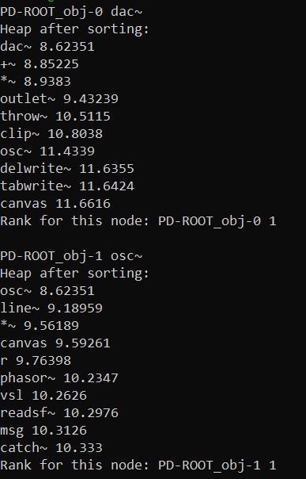
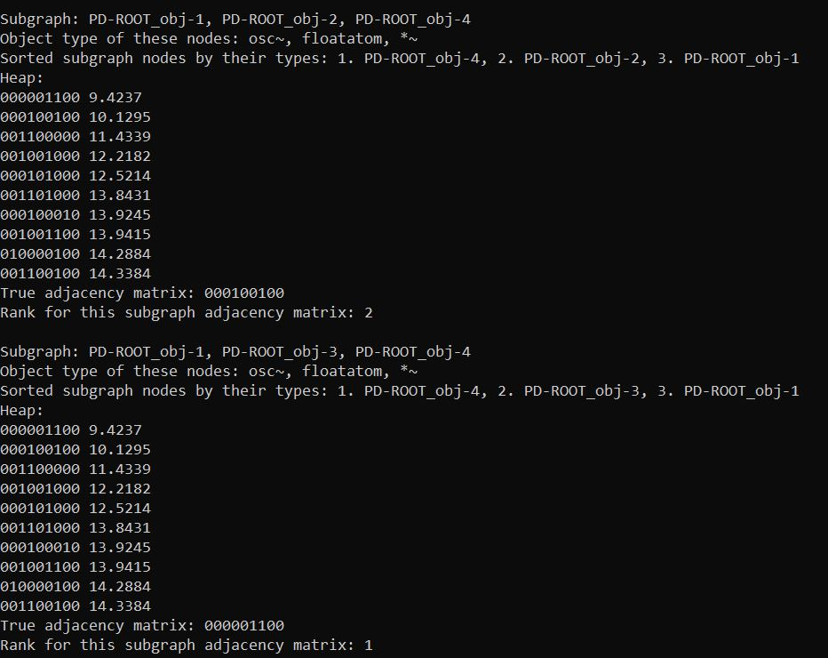

# Graph Based Probabilistic Model for Node and Edge Prediction in Pure Data
We implement a code prediction model for Pure Data(PD) subgraphs in this project. Our goal is to predict the nodes and edges of a PD graph by utilizing the graph nature of the PD programs.

## Methodology
The methodology is as follows:
1. We build a graph from the list of connections in a parsed Pure Data file.
2. After that, we extract the unique nodes (object_types such as "msg", "tgl" etc), count the frequency of each token, and save it in a dictionary called `frequency_1_gram`.
3. For each unique connection, we create adjacency matrices, calculate the frequencies of the unique connections, and save it in a dictionary called `frequency_2_grams`.
4. Then, we find the three-node subgraphs from the input graph, create adjacency matrices, calculate the frequencies of the 3-node subgraphs, and store them in a dictionary called `frequency_3_grams`.
5. Finally, we answer the following questions.
    -  In the scenario of a PD graph featuring an empty node, how effectively can our model predict which node will fill the empty position?
    - Given three nodes in a PD graph that could potentially be interconnected, how effectively can our model identify the most probable edges connecting these 3-node combinations?

## PD database
The PD database used in this project can be downloaded from the following links:
- https://archive.org/details/Opening_the_Valve_on_Pure_Data
- https://doi.org/10.5281/zenodo.10576757

For the code prediction model, please keep the *database.db* file inside the src_c++ directory.

## How to create the corpus

At first, create a directory called *vocabulary_frequencies* inside the *src_c++* directory to store information about all 1-node, 2-node, and 3-node subgraphs.
- `cd src_c++`
- `mkdir vocabulary_frequencies`

### Step 1: Creating the unique token corpus with their frequencies

1. To create the corpus of unique tokens and their frequencies, go to *src_c++* directory.
- `cd src_c++`

2. Then run the file using the following commands:
- `g++ -O3 -fconcepts -o 1_gram.exe 1_extract_unique_tokens_db.cpp utils.cpp graph.cpp -lsqlite3`
- `./1_gram.exe ./train_test_hashes/model_1/train_hashes.txt database.db`

Please note that the training hash file contains the SHA-256 hash ID of the parsed PD files in the training set, while the *database.db* file stores the contents of the parsed PD file. You can select any of the 5 available train and test splits located in the `train_test_hashes` directory. Thus, the second command essentially looks like this: `./1_gram.exe <train_hashes_file_location> <database_file_location>`. 

The unique tokens and their frquencies will be stored in *unique_tokens_train.txt* and *frequency_1_gram_train.txt* files inside the *vocabulary_frequencies* directory.

### Step 2: Creating the corpus of 2-node subgraphs and their frequencies
1. To create the corpus of 2-node subgraphs and their frequencies, go to *src_c++* directory.
- `cd src_c++`

2. Then run the file using the following commands:
- `g++ -O3 -fconcepts -o 2_grams.exe 2_extract_2_gram_frequencies_db.cpp utils.cpp graph.cpp -lsqlite3`
- `./2_grams.exe ./train_test_hashes/model_1/train_hashes.txt database.db`

Please note that the training hash file contains the SHA-256 hash ID of the parsed PD files in the training set, while the *database.db* file stores the contents of the parsed PD file. You can select any of the 5 available train and test splits located in the `train_test_hashes` directory. Thus, the second command essentially looks like this: `./2_grams.exe <train_hashes_file_location> <database_file_location>`. 

The 2-node subgraphs and their frquencies will be stored in *frequency_2_grams_train.txt* file inside the *vocabulary_frequencies* directory. Please note that the format of *frequency_2_grams_train.txt* includes the indices of the 2-gram nodes in the unique tokens corpus, which is sorted lexicographically when loaded. It also contains the adjacency matrix between the nodes and the frequency of how often these two nodes and this adjacency matrix appear in the training data.

### Step 3: Creating the corpus of 3-node subgraphs and their frequencies

1. To create the corpus of 3-node subgraphs and their frequencies, go to *src_c++* directory.
- `cd src_c++`

2. Then run the file using the following commands:
- `g++ -O3 -fconcepts -o 3_grams.exe 3_extract_3_gram_frequencies_db.cpp utils.cpp graph.cpp -lsqlite3`
- `./3_grams.exe ./train_test_hashes/model_1/train_hashes.txt database.db`

Please note that the training hash file contains the SHA-256 hash ID of the parsed PD files in the training set, while the *database.db* file stores the contents of the parsed PD file. You can select any of the 5 available train and test splits located in the `train_test_hashes` directory. Thus, the second command essentially looks like this: `./3_grams.exe <train_hashes_file_location> <database_file_location>`.

The 3-node subgraphs and their frequencies will be stored in the *frequency_3_grams_train_all.txt* file, located in the *vocabulary_frequencies* directory. To merge duplicates and sum the occurrences of each unique 3-node subgraph, run the *merge.py* script in the *src_c++* directory:
- `python3 merge.py`

This command will generate a new file called *frequency_3_grams_train.txt* in the *vocabulary_frequencies* directory, containing the final corpus of 3-node subgraphs along with their frequencies after the merging process.

Please note that the format of *frequency_3_grams_train.txt* includes the indices of the 3-gram nodes in the unique tokens corpus, which is sorted lexicographically when loaded. It also contains the adjacency matrix between the nodes and the frequency of how often these three nodes and this adjacency matrix appear in the training data.

### Step 4: Get observed three grams

To extract the observed 3-grams from the data, ignoring the adjacency matrix, use the following commands:
- `cd vocabulary_frequencies`
- `cat frequency_3_grams_train.txt | cut -d "," -f 1-3 | sort -u  > observed_3_grams_train.txt`

This will output the unique 3-gram combinations found in the corpus and save them in the `observed_3_grams_train.txt` file.

## How to run our code for predicting the nodes and edges of a PD graph

The sample corpus for the subsequent stages is provided in the *src_c++/sample_corpus* directory, using the PD database mentioned above. If you want to use the sample corpus, copy all the files of the `sample_corpus` directory to the `vocabulary_frequencies` directory before running the following commands. You can replace it with your own corpus if needed.

### Step 1: Parsing the PD file contents (Skip this step if you have the parsed content of a PD file or if you are using the PD database of parsed source files)

1. To parse a PD file into an Abstract Syntax Tree, at first move to the directory *parsing_the_PD_file_contents*

- `cd parsing_the_PD_file_contents`

2. Then, provide the location of your PD file as an argument of the *parse.py* file and run it using Python

- `python parse.py <location_of_PD_file>`

3. The parsed output will be saved in the *example_PD_file_and_parsed_output* directory as a file named *example.json*

### Step 2: Predict the nodes and edges of a PD graph

1. To predict the nodes and edges of the PD graph, at first move to the *src_c++* directory.

- `cd src_c++`

2. At first parse the file using the procedure mentioned in Step 1 (or skip that step if you already have a parsed file). 

3. To predict the nodes:

    - Run the file using the following commands:

        - `g++ -O3 -fconcepts -o node.exe 4_node_predictor_local.cpp utils.cpp graph.cpp -lsqlite3`
        - `./node.exe ../sample_jsons/example_basic.json`

    - Please note that, `../sample_jsons/example_basic.json` is an example parsed PD file provided in this repository. You can put the location of your parsed PD file in this place. Thus, the second command essentially looks like this: `./node.exe <parsed_pd_file_location>`.
    
    - If you want to do bulk prediction, you can run the following two commands:
        - `g++ -O3 -fconcepts -o node.exe 4_node_predictor_db.cpp utils.cpp graph.cpp -lsqlite3`
        - `./node.exe ./train_test_hashes/model_1/test_hashes_filtered.txt database.db`
    
    - Please note that the test hash file contains the SHA-256 hash ID of the parsed PD files in the test set, while the *database.db* file stores the contents of the parsed PD file. You can select any of the 5 available train and test splits located in the `train_test_hashes` directory. Thus, the second command essentially looks like this: `./node.exe <test_hashes_file_location> <database_file_location>`. 
    
    - Our node predictor model will replace the nodes in your PD file with a *BLANK*. For each node, based on its context, the model will predict the most likely node to fill that position. The output will include the rank of the actual node within the prediction heap and the contents of the heap after the prediction phase. Note that the heap contains the negative log probability scores of the tokens, meaning the highest real probability corresponds to the lowest negative log probability. As a result, the heap is sorted in ascending order, with the topmost entry being the most likely node to fill the *BLANK* position. A sample format of output is shown below:

    

4. To predict the edges:
    - Run the file using the following commands:

        - `g++ -O3 -fconcepts -o edge.exe 4_edge_predictor_local.cpp utils.cpp graph.cpp -lsqlite3`
        - `./edge.exe ../sample_jsons/example_basic.json`
    - Please note that, `../sample_jsons/example_basic.json` is an example parsed PD file provided in this repository. You can put the location of your parsed PD file in this place. Thus, the second command essentially looks like this: `./edge.exe <parsed_pd_file_location>`.
    
    - If you want to do bulk prediction, you can run the following two commands:
        - `g++ -O3 -fconcepts -o edge.exe 4_edge_predictor_db.cpp utils.cpp graph.cpp -lsqlite3`
        - `./edge.exe ./train_test_hashes/model_1/test_hashes_filtered.txt database.db`
    
    - Please note that the test hash file contains the SHA-256 hash ID of the parsed PD files in the test set, while the *database.db* file stores the contents of the parsed PD file. You can select any of the 5 available train and test splits located in the `train_test_hashes` directory. Thus, the second command essentially looks like this: `./edge.exe <test_hashes_file_location> <database_file_location>`. 

    - Our edge predictor model will take every three node subgraph of your PD graph, and predict the most probable edges between these three nodes. Note that the heap contains the negative log probability scores of the tokens, meaning the highest real probability corresponds to the lowest negative log probability. As a result, the heap is sorted in ascending order, with the topmost entry being the most likely adjacency matrix representing the connections between the three nodes. The digits in the adjacency matrix follow this sequence: 00, 01, 02, 10, 11, 12, 20, 21, 22. For instance, 01 indicates whether there is a directed edge from node 0 to node 1. Therefore, an adjacency matrix like 001000010 means there is an edge from node 0 to node 2 and an edge from node 2 to node 1. The nodes are ordered based on their object type. A sample format of output is shown below:
    
    

    - Alternatively, you can run the baseline version of our edge prediction model by running the *4_edge_predictor_baseline_local.cpp* and *4_edge_predictor_baseline_db.cpp* files following the same procedures mentioned above.

## Testing our code

We have included sample tests for various methods used in our code, such as the heap functionality, score calculation, corpus creation logic, and some utility methods from the utils.cpp file. To run the tests, navigate to the src_c++ directory and execute the test.sh script.
- `cd src_c++`
- `./test.sh`
